# Fragment Autocomplete — Technical Architecture Draft

| Field | Value |
| --- | --- |
| Title | Fragment Autocomplete — Technical Architecture Draft |
| Project | Fragment Autocomplete: Virtual Reconstruction of Medieval Manuscripts using Machine Learning |
| Funding | Pro*Niedersachsen |
| Host | Institute for Digital Humanities, University of Göttingen |
| Status | Architecture Draft |
| Version | 0.2 |
| Date | 2026-05-06 |
| Author | Mohamed Basuony |

## Document Purpose

This document defines the initial technical architecture for Fragment Autocomplete. It establishes the system boundaries, core data model, layout-first reconstruction strategy, eManuSkript integration role, storage architecture, evaluation architecture, and implementation sequence. It is not an implementation report and does not claim that the described components are already built.

## Table of Contents

- 1. Executive Summary
- 2. Project Scope and Architectural Principles
- 3. Scholarly Safety Model
- 4. Core System Goals
- 5. Non-Goals and Explicitly Avoided Claims
- 6. High-Level System Architecture
- 7. System Context
- 8. Component Architecture
- 9. Data Ingestion Architecture
- 10. IIIF Integration Architecture
- 11. Image and Metadata Storage Architecture
- 12. eManuSkript-Centered Layout Analysis Pipeline
- 13. Artificial Fragment Generation Pipeline
- 14. Layout-First Reconstruction MVP
- 15. Retrieval-Based Reconstruction Layer
- 16. Optional Segmentation-Conditioned Model Layer
- 17. Reconstruction Candidate Data Model
- 18. Database Architecture Overview
- 19. CoMMA Text and Metadata Integration
- 20. MSI Layer Integration
- 21. Web/API Interface Architecture
- 22. Evaluation Architecture
- 23. Export Architecture
- 24. Deployment and Reproducibility Architecture
- 25. Security, Rights, and Access-Control Considerations
- 26. Data Lifecycle
- 27. Risks and Mitigation
- 28. Implementation Roadmap
- 29. Key Open Decisions
- 30. Next Engineering Milestone

## 1. Executive Summary

Fragment Autocomplete is a two-year Pro*Niedersachsen research-software project hosted at the Institute for Digital Humanities, University of Göttingen. The project will build an open-source and open-access toolchain for virtual reconstruction of medieval manuscript fragments.

The architecture is evidence-preserving and layout-first. The first useful system should estimate page canvas, margins, columns, semantic layout zones, and plausible fragment placement before attempting any experimental full-image synthesis. Reconstruction outputs are ranked candidate scholarly hypotheses based on observed fragment evidence, layout analysis, retrieved analogues, metadata, and explicit uncertainty.

The central technical asset is the existing eManuSkript / "Manuskripte digital lesen lernen" layout-analysis model. CoMMA is treated as a supporting text and metadata resource, not as the primary visual reconstruction dataset.

## 2. Project Scope and Architectural Principles

Core architectural principles:

- Layout-first before image generation.
- eManuSkript is the backbone for manuscript layout understanding.
- Multiple candidates are expected; the system should not force a single answer.
- Provenance and uncertainty must remain visible in UI, exports, APIs, and evaluation.
- CoMMA supports text search and metadata enrichment, not visual reconstruction ground truth.
- IIIF, MSI, and metadata interoperability are first-class requirements.
- The system should fail gracefully when evidence is insufficient.
- Observed evidence must remain separate from inferred structure and illustrative fill.

The project scope includes ingestion, layout analysis, candidate generation, review, evaluation, and export. The implementation should proceed incrementally from durable data structures and layout analysis toward retrieval, evaluation, and later experimental modeling.

## 3. Scholarly Safety Model

The system separates three layers:

- Observed evidence: surviving fragment pixels, masks, contours, measured dimensions, source metadata, rights metadata, and expert annotations.
- Inferred structure: estimated page canvas, margins, columns, zones, placement transforms, line/baseline estimates, candidate analogues, and uncertainty scores.
- Illustrative fill: optional visual material used only to communicate a candidate hypothesis or support interface context.

UI and exports must label these layers explicitly. A viewer should distinguish original fragment pixels from inferred page structure. Exported PDF, JSON, PAGE-XML, ALTO, TEI, or metadata bundles must retain provenance fields and uncertainty values. Any illustrative fill must be named as illustrative, not restored or recovered content.

## 4. Core System Goals

The final system should:

- Ingest IIIF and local manuscript images.
- Store metadata, provenance, rights, and access constraints.
- Segment pages and fragments via eManuSkript.
- Generate artificial fragments from complete pages for controlled evaluation.
- Infer page geometry and layout candidates.
- Retrieve analogous pages and layout templates.
- Optionally train segmentation-conditioned models after a layout/retrieval baseline exists.
- Support CoMMA text search and metadata enrichment.
- Support multispectral imaging layers.
- Export reconstruction candidates and metadata as PDF, JPEG/PNG, JSON, and structured metadata formats.
- Evaluate outputs with metrics and expert review.

## 5. Non-Goals and Explicitly Avoided Claims

The project will not claim to recover original missing text, decoration, or page appearance unless external evidence supports that claim. Full visual generation is not the MVP. It is an experimental later layer that must be constrained by layout, evidence, and uncertainty.

Avoided claims include:

- "The original page has been reconstructed."
- "The missing text has been recovered."
- "The decoration has been restored."
- "The model knows the original manuscript."
- "The generated page is historically accurate."

Correct framing:

"The system proposes ranked candidate page-level hypotheses based on observed fragment evidence, layout analysis, retrieved analogues, metadata, and explicit uncertainty."

## 6. High-Level System Architecture

Figure 2 shows the end-to-end technical pipeline from data sources through ingestion, preprocessing, eManuSkript layout analysis, layout-first reconstruction, retrieval, optional conditioned modeling, and review/export interfaces.

The high-level architecture begins with curated data sources and local scholarly inputs. IIIF manifests, local images, metadata, and later MSI layers are registered and normalized. eManuSkript produces layout labels and segmentation outputs. Complete pages support artificial-fragment generation for supervised evaluation. The MVP estimates layout-first reconstruction candidates, ranks them using retrieval evidence, and exposes them through web, API, export, and evaluation interfaces.

## 7. System Context

Figure 1 shows the external actors, data sources, infrastructure, and outputs connected to the Fragment Autocomplete system.

Fragment Autocomplete sits between scholars, fragment specialists, digitization partners, manuscript repositories, storage infrastructure, and export consumers. SUB Göttingen contributes digitization and multispectral imaging expertise. Fragmentarium supports fragment analysis, digital-fragment representation, and digital-fragment standards. e-codices and other IIIF repositories provide compatible manuscript image sources. CoMMA supports text and metadata discovery. GWDG or equivalent institutional infrastructure is the likely long-term home for storage, compute, and deployment.

## 8. Component Architecture

Figure 3 presents the main application and infrastructure components expected in the mature research system.

The system is organized as separate components:

- Frontend: scholarly review UI with IIIF viewer, segmentation overlays, candidate comparison, metadata editing, uncertainty/provenance panels, and export controls.
- Backend API: authenticated access to project entities, jobs, candidates, annotations, exports, and search.
- Async job workers: long-running ingestion, segmentation, retrieval, candidate generation, export, and evaluation jobs.
- PostgreSQL/PostGIS database: relational metadata, provenance, geometry, review status, and job state.
- Object/file storage: large images, MSI layers, masks, SVG/PNG overlays, model artifacts, and exports.
- eManuSkript service: layout segmentation and label-map generation.
- Retrieval index: visual embeddings, layout descriptors, label histograms, zone graphs, and metadata filters.
- Evaluation service: metric computation, experiment summaries, failure taxonomy, and expert-review aggregation.
- Export service: PDF, image, JSON, PAGE-XML/ALTO, TEI, and later RDF/LOD outputs.

## 9. Data Ingestion Architecture

Ingestion should support local upload and IIIF manifest registration. Local upload must capture source, rights, checksum, file type, image dimensions, and optional physical measurements. IIIF ingestion must cache manifest metadata, register canvases and image services, record source provenance, and avoid duplicating large assets unless local caching is explicitly required.

Metadata normalization should separate raw source metadata from normalized project fields. Raw records can be stored as JSONB for traceability, while core fields such as repository, shelfmark, date range, language, rights, and manuscript/page identifiers should be normalized into explicit tables.

## 10. IIIF Integration Architecture

IIIF integration should use the IIIF Presentation API for manifests, canvases, metadata, and annotations, and the IIIF Image API for image retrieval and tile-compatible viewing. The ingestion layer should parse manifests, extract canvas and image-service data, validate identifiers, record source provenance, and store enough metadata to refresh or re-resolve sources later.

The frontend should use an IIIF-capable viewer for source images, candidate overlays, and comparison pages. IIIF should also support exportable provenance: candidate outputs should identify the source manifest, canvas, image service, and retrieval analogues whenever available.

## 11. Image and Metadata Storage Architecture

PostgreSQL should be the primary relational database. PostGIS should be enabled for geometric data such as fragment contours, bounding boxes, polygons, layout regions, page coordinates, and placement transforms.

Large images, MSI layers, generated masks, model artifacts, embeddings, and export bundles should live outside the relational database in object storage or a managed filesystem. The database should store URI/path, checksum, media type, dimensions, rights metadata, access controls, processing provenance, and version identifiers.

For the validated local prototype, source JPEGs live under `data/raw/<corpus>/<manuscript>/`, raw IIIF manifests under `data/raw/<corpus>/_manifests/`, eManuSkript segmentation artifacts under `outputs/training_corpus_segmentation/`, other generated binaries under `outputs/`, and compact committed provenance/statistics under `data/metadata/`. The validated segmentation workflow is not moved into `data/processed/`. Batch 01 demonstrates this convention with 70 source JPEGs from 14 active manuscripts, totaling 96,587,059 bytes; the specification retains 15 assigned manifests.

The eventual GWDG or other institutional object-storage target, backup, retention, and quota remain open operational decisions. They do not block the current local acquisition workflow.

JSONB is appropriate for raw source metadata, raw IIIF manifest snapshots, model-output payloads during early experimentation, and compatibility fields. Core project entities should still use normalized tables to support filtering, joins, auditability, and long-term maintainability.

## 12. eManuSkript-Centered Layout Analysis Pipeline

Figure 5 summarizes the architectural roles of eManuSkript as a reusable source of layout structure across ingestion, retrieval, UI, evaluation, and later model conditioning.

eManuSkript is the central layout-analysis backbone. It should be used as:

- A segmentation artifact: labels, masks, confidence maps, polygons, and overlays stored as versioned outputs.
- A pseudo-label generator: newly harvested pages can receive provisional layout labels for training or review.
- A layout prior: estimated page geometry and candidate layouts should be constrained by plausible manuscript structures.
- A retrieval key: label histograms, zone adjacency graphs, column counts, spatial moments, and region geometry can retrieve similar pages.
- A UI overlay: scholars can inspect and correct layout labels.
- An evaluation signal: eManuSkript can be run on outputs to check structural consistency.
- An optional conditioning map: later neural models can consume semantic label maps alongside RGB/MSI inputs.

The first implementation should persist eManuSkript outputs before using them for model conditioning.

## 13. Artificial Fragment Generation Pipeline

Artificial fragments should be generated from complete manuscript pages so ground truth is known. Each task should preserve the source page link, generation parameters, random seed, mask family, degradation profile, and expected placement transform.

The generator should support irregular torn contours, binding-strip shapes, holes, perforations, corner losses, trimmed margins, missing outer/inner margins, stains, fading, bleed-through, discoloration, low contrast, rotation, blur, noise, and partial cropping.

Train/validation/test splits must occur by manuscript, not just by page. Where possible, the split should be stratified by repository, century, script family, layout type, and damage type.

## 14. Layout-First Reconstruction MVP

The MVP input includes a fragment image, fragment mask/contour, metadata, eManuSkript labels, and optional estimated orientation. The output is not generated missing text. It is a structured set of candidate estimates:

- Full-page canvas and dimension range.
- Margins.
- Column count and column geometry.
- Semantic layout zones.
- Fragment placement candidates.
- Optional line or baseline estimates.
- Score and uncertainty.
- Provenance and retrieved comparators.

The MVP should be useful even when it produces "insufficient evidence" or multiple low-confidence candidates.

## 15. Retrieval-Based Reconstruction Layer

Retrieval should compare fragments and estimated layouts against complete pages and layout templates. Features may include eManuSkript label histograms, zone adjacency graphs, column counts, spatial moments, visual embeddings, script/layout descriptors, manuscript metadata, date/language filters, and repository constraints.

Candidate ranking must be explainable. A candidate should show why analogues were retrieved, what metadata matched, which layout descriptors matched, and where evidence is weak.

## 16. Optional Segmentation-Conditioned Model Layer

Segmentation-conditioned modeling is experimental and should follow a working layout/retrieval baseline. Possible model families include U-Net variants, encoder-decoder architectures, transformer-based segmentation or layout completion models, diffusion models, and ControlNet-style conditioning.

The first target should be layout-map completion or coarse page-structure estimation, not final historical imagery. Model inputs may include fragment image, fragment mask, eManuSkript label maps, metadata, MSI channels if available, and artificial-fragment pairs.

## 17. Reconstruction Candidate Data Model

Figure 6 shows how fragment evidence, masks, metadata, and segmentation outputs flow into placement estimation, template retrieval, candidate ranking, uncertainty scoring, and expert review.

`reconstruction_candidate` is a first-class object. A fragment can have multiple candidates, and candidates can come from different rules, retrieval methods, model versions, or expert revisions.

Each candidate should store:

- Candidate ID.
- Fragment ID.
- Reconstruction job ID.
- Model, rule, and retrieval provenance.
- Canvas estimate.
- Zone estimate.
- Placement transform.
- Score and uncertainty.
- Linked analogues.
- Export paths.
- Expert-review status.

Candidates should remain comparable over time, so model versions, data versions, and generation parameters must be preserved.

## 18. Database Architecture Overview

Figure 7 gives the first entity-level view of the recommended PostgreSQL/PostGIS schema.

Initial entities:

- `repository`: source institution or digital repository.
- `manuscript`: codicological manuscript grouping.
- `witness`: textual or manuscript witness, including possible CoMMA links.
- `iiif_manifest_cache`: cached manifest metadata and fetch provenance.
- `canvas/page`: IIIF canvas or local page record.
- `image_asset`: registered image file or IIIF image service.
- `msi_asset`: aligned multispectral layer or MSI stack reference.
- `fragment`: surviving fragment record with contour and metadata.
- `annotation`: expert or system annotation.
- `segmentation_run`: model run metadata, version, parameters, and source asset.
- `layout_region`: labels, polygons, confidence values, and region geometry.
- `artificial_fragment_task`: synthetic fragment generation record.
- `reconstruction_job`: candidate-generation job metadata.
- `reconstruction_candidate`: ranked candidate hypothesis.
- `retrieval_embedding`: vector and descriptor references.
- `text_witness_link`: CoMMA or other text/metadata link.
- `evaluation_run`: metric and review batch.
- `export_bundle`: generated export package and rights status.

Full migrations are the next engineering milestone.

## 19. CoMMA Text and Metadata Integration

CoMMA should support text search, candidate witness discovery, IIIF manifest discovery, metadata enrichment, language/date filtering, and search-term suggestions. It can help connect known or suspected text to manuscript witnesses and identify potential complete pages for later artificial-fragment experiments if licensing and IIIF access allow.

Limitations must be explicit. CoMMA may include HTR-derived text and is not guaranteed diplomatic ground truth. It is not a visual reconstruction dataset, not the main training image dataset, and not a replacement for curated visual sources from SUB Göttingen, Fragmentarium, e-codices, or other repositories. Schema ingestion must be robust to partial, inconsistent, or evolving records.

## 20. MSI Layer Integration

MSI should be optional early. MSI layers should be stored as aligned assets with wavelength or modality metadata, registration provenance, checksums, access rights, and links to the visible-light image or fragment.

The viewer should eventually support toggling MSI layers, comparing layers, and preserving layer provenance in exports. The MVP model input should not depend on MSI availability. Year 2 can integrate MSI more deeply for improved readability, fragment analysis, and expert review.

## 21. Web/API Interface Architecture

The web interface should support:

- Fragment viewer.
- Segmentation overlay.
- Estimated page canvas.
- Candidate list.
- Uncertainty and provenance panel.
- IIIF viewer.
- MSI layer toggle.
- Text search panel.
- Metadata editor.
- Export panel.
- Evaluation review panel.

The API should expose project entities, source registration, jobs, segmentation outputs, candidate reconstructions, reviews, exports, and search. Long-running tasks should be submitted as jobs rather than blocking request/response interactions.

## 22. Evaluation Architecture

Figure 8 shows the evaluation loop from controlled artificial-fragment tasks through prediction, metrics, expert review, failure analysis, and model or rule updates.

Evaluation should prioritize structural and scholarly usefulness over pixel similarity. Metrics include page-size error, placement accuracy, zone IoU/F1, column-count accuracy, margin deviation, line-count error, retrieval recall@k, expert plausibility rubric, and failure taxonomy.

Pixel metrics are secondary and can be misleading because multiple visual completions may be plausible or illustrative. Evaluation should distinguish artificial-fragment tasks with known ground truth from real fragments where only expert plausibility and provenance quality can be assessed.

## 23. Export Architecture

Exports should include PDF, JPEG/PNG, JSON, PAGE-XML or ALTO where appropriate, TEI/metadata export, and later RDF/LOD-compatible export.

Every export must preserve uncertainty and provenance. Export bundles should identify observed fragment pixels, inferred structure, candidate analogues, model or rule provenance, review status, rights constraints, and generated file paths. Exports should not imply that candidate reconstructions are confirmed historical originals.

## 24. Deployment and Reproducibility Architecture

Figure 9 outlines the expected deployment topology for a local research prototype and later institutional deployment.

The deployment architecture should support a local research prototype first, then a GWDG or equivalent institutional deployment. Expected components are browser UI, backend API, async queue and workers, model services, PostgreSQL/PostGIS, object storage, logs/monitoring, and optional GWDG/HPC resources for heavier jobs.

Reproducibility requirements include experiment tracking, data and model versioning, generation manifests, configuration files, checksums, deterministic artificial-fragment generation where possible, and repeatable validation commands. Docker or Apptainer may be useful later for reproducible services and compute environments.

## 25. Security, Rights, and Access-Control Considerations

The data model should include item-level rights metadata and explicit flags such as `training_allowed`, `publication_allowed`, `demo_allowed`, and access level. Private and public datasets must be separated. Restricted assets must not be published in demos, exported without permission, or used for training unless permitted.

Source acquisition does not confer training authorization. Ingestion may refresh repository-supplied license, rights, attribution, and access metadata, but a human-reviewed `rights_review_status`, `training_allowed` value, and its versioned review provenance must survive ordinary reruns. New assets remain unapproved for training unless a separate human review explicitly changes them. The existing fields plus `image_asset.raw_metadata.rights_review` provide this separation without a schema migration.

Model and data provenance must be retained so generated outputs can be traced back to allowed sources. External IIIF assets should preserve source attribution and rights statements.

## 26. Data Lifecycle

Figure 4 describes the lifecycle of source material and derived artifacts from raw source registration through export bundles.

The data lifecycle moves from raw source registration to cached image assets, normalized metadata, segmentation runs, artificial-fragment tasks, reconstruction candidates, evaluation results, and export bundles. Each stage should preserve parent links, processing parameters, checksums, rights, and review status.

The lifecycle should support reprocessing when eManuSkript versions, segmentation parameters, schema versions, or retrieval indexes change.

## 27. Risks and Mitigation

| Risk | Mitigation |
| --- | --- |
| Hallucination or overconfident visual outputs | Keep layout-first MVP, label illustrative fill, expose uncertainty, and require provenance-linked candidates. |
| Insufficient ground truth | Use artificial fragments from complete pages and separate real-fragment expert review from supervised metrics. |
| Licensing ambiguity | Store item-level rights, training/publication/demo flags, and source attribution before processing. |
| Dataset heterogeneity | Normalize metadata, stratify splits, and report performance by repository, date, script, layout, and damage type. |
| Weak generalization | Start with explainable retrieval and layout priors, then evaluate model layers only after baselines. |
| Poor MSI alignment | Treat MSI as optional early, store alignment provenance, and validate layer registration before model use. |
| CoMMA overuse | Restrict CoMMA to text/metadata workflows and document its limitations. |
| Evaluation drift | Maintain a fixed evaluation set, expert rubric, failure taxonomy, and versioned metrics. |
| Compute limits | Use async jobs, queueing, cached intermediate outputs, and staged model experiments. |
| Scope creep | Maintain clear milestone ownership and avoid bundling unrelated implementation work into early foundations. |

## 28. Implementation Roadmap

Figure 10 shows the early milestone sequence from repository setup through architecture, data ingestion, segmentation, evaluation, and first prototype work.

The implementation sequence should proceed in phases:

- Phase 1: Database and storage foundation. Define PostgreSQL/PostGIS migrations, rights fields, geometry representations, object/file storage conventions, and schema validation.
- Phase 2: IIIF ingestion and sample dataset registration. Register selected complete pages and real fragments with provenance, rights, and stable identifiers.
- Phase 3: eManuSkript segmentation storage. Persist model outputs as layout regions, masks, polygons, confidence values, overlays, and versioned runs.
- Phase 4: Artificial fragment generation. Create controlled synthetic fragment tasks from complete pages with reproducible masks, degradations, and ground-truth placement links.
- Phase 5: Layout-first reconstruction MVP. Estimate page canvas, margins, columns, semantic zones, and placement candidates without claiming recovered missing content.
- Phase 6: Retrieval-based reconstruction. Rank analogue pages and templates using layout descriptors, metadata filters, visual embeddings, and explainable provenance.
- Phase 7: Optional segmentation-conditioned modeling. Explore layout-map completion or coarse structural prediction after the baseline is measurable.
- Phase 8: Research interface, evaluation, export, and deployment. Provide the review UI, evaluation dashboard, export bundles, and institutional deployment path.

## 29. Key Open Decisions

The main unresolved architecture decisions are:

- Final GWDG or other institutional object-storage target, backup policy, retention policy, and quota. The current local path convention is already fixed and is not blocked by this decision.
- IIIF viewer choice.
- Exact eManuSkript output format and conversion path.
- PAGE-XML vs internal JSON for segmentation storage.
- Ownership and operating procedure for source-by-source human training-rights review.
- Evaluation rubric ownership and review process.
- Timing of CoMMA ingestion.

## 30. Next Engineering Milestone

The next engineering milestone is **Batch 01 → eManuSkript Segmentation at Expanded Scale**. It reuses the validated eManuSkript inference, source-dimension mask restoration, provenance, and PostgreSQL storage workflow over the 70 acquired Batch 01 pages; it does not introduce a second segmentation implementation.

Acceptance criteria for that milestone:

- Every acquired Batch 01 page is attempted, and each failure remains explicit rather than being silently dropped or replaced.
- Successful instance masks match their source-image dimensions and retain model, run, configuration, checksum, canvas, manuscript, and repository provenance.
- Deterministic corpus/model/config identity and idempotent `segmentation_run`/`layout_region` storage remain valid at the expanded scale.
- Source files, checksums, manuscript-level splits, harvested rights, `rights_review_status`, and `training_allowed` remain unchanged by segmentation.
- Mask binaries, raw predictions, and overlays remain ignored local artifacts under `outputs/training_corpus_segmentation/`.
- Model training, artificial-fragment generation, reconstruction, retrieval, and UI expansion remain out of scope.
